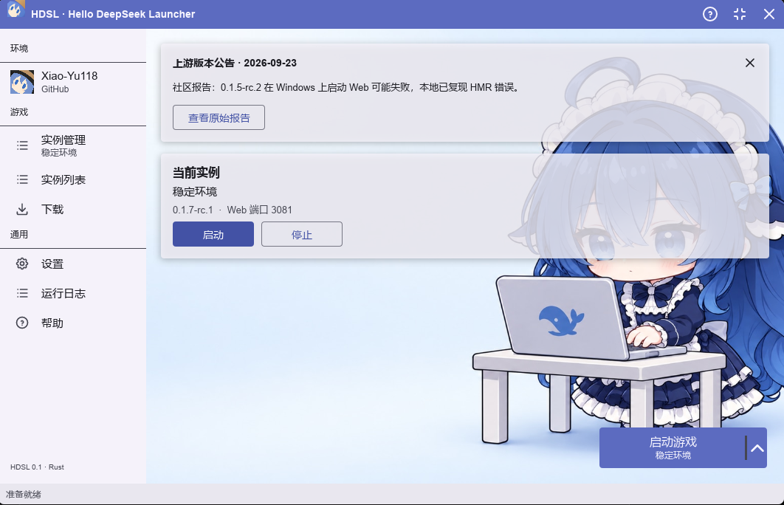
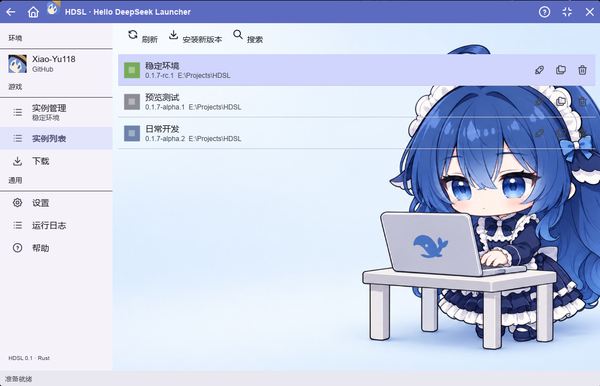
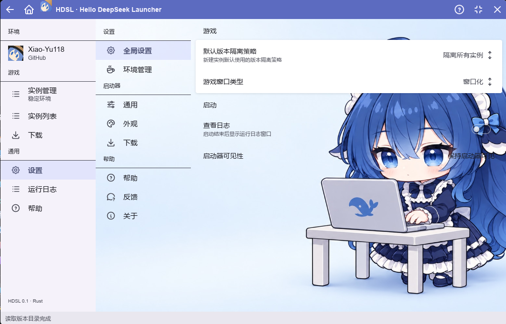

# HDSL

HDSL 是基于 Rust 和 [Slint](https://slint.dev/) 的 DeepSeek Harness 桌面启动器。它为每个实例安装指定版本的 `@deepseek-ai/dsh`，隔离运行目录，并提供实例、兼容插件和运行日志的图形界面。导航方式参考 HMCL；界面资源由本项目独立创作。

## 当前状态

项目处于开发预览阶段，尚无公开发行版。仓库提供 Windows x64、Linux x64 和 Linux arm64 的构建与打包配置；各平台的发行验证尚未完成。当前功能和限制以[功能状态](docs/developer/src/status.md)为准。

## 功能

- 查看 npm 发布的 Harness 版本，包括预览版；按精确版本创建和启动实例。
- 为实例单独保存 Harness 安装、工作目录、端口和 `DSH_HOME`；可以停止、复制或删除实例。
- 搜索有兼容证据的插件版本，在当前实例中安装和卸载；操作失败时恢复原有 `web` profile。
- 查看实例运行日志，按级别着色和筛选。

模型路由、API Key 和端点在 Harness 自身的页面中配置；HDSL 不提供这些设置的编辑入口。

## 构建与运行

安装 Rust stable 和目标平台所需的编译工具后，在仓库根目录运行：

```sh
cargo run -p hdsl
```

Windows GNU 目标还需要将 `C:\msys64\mingw64\bin` 加入 `PATH`，以便链接 `shlwapi`。详细步骤见[安装与启动](docs/user/src/install.md)，构建与打包要求见[开发者手册](docs/developer/src/release.md)。

## 界面预览







## 文档

- [用户手册](docs/user/src/README.md)
- [开发者手册](docs/developer/src/README.md)
- [功能状态与限制](docs/developer/src/status.md)

## 许可

本项目采用 [GPL-3.0-only](LICENSE)，来源声明见 [NOTICE](NOTICE)。HDSL 不是 HMCL 或 DeepSeek AI 的官方产品。
